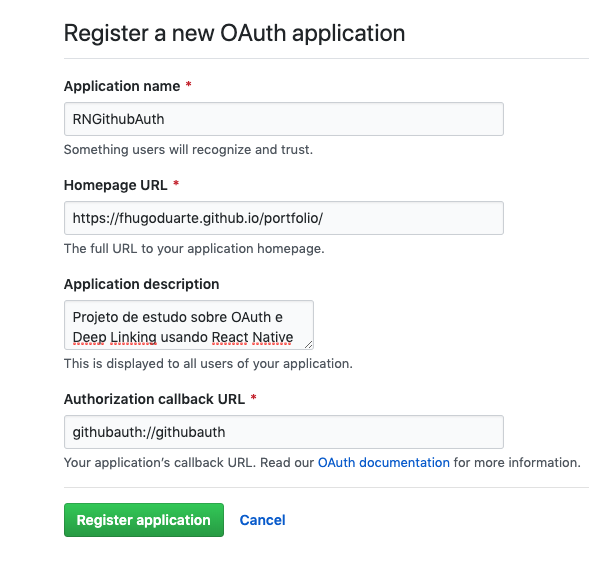
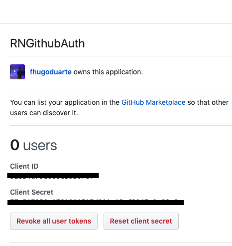
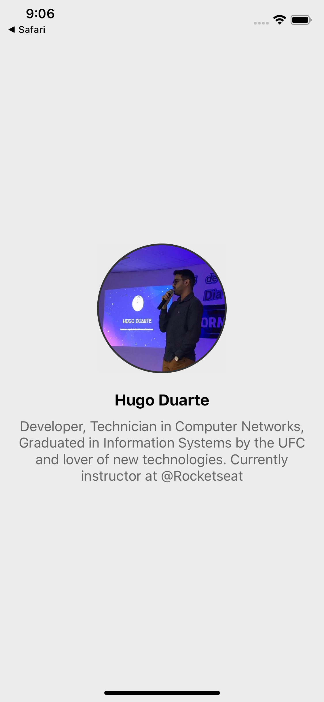

# RNGithubAuth

Projeto de estudo sobre OAuth e Deep Linking usando React Native

- [RNGirhubAuth](#rngirhubauth)
  - [OAuth](#oauth)
  - [Criando OAuth App](#criando-oauth-app)
  - [Deep Linking](#deep-linking)
  - [Requisitando autenticação](#requisitando-autentica%c3%a7%c3%a3o)
  - [Client ID e Client Secret](#client-id-e-client-secret)
  - [Buscando Token de acesso](#buscando-token-de-acesso)
  - [Buscando dados do usuário](#buscando-dados-do-usu%c3%a1rio)

## OAuth

Resumidamente, é um protocolo que permite que clientes de uma aplicação se autentiquem através de uma aplicação de terceiro, como Facebook, Google, Github...

## Criando OAuth App

Primeiramente, precisamos criar um OAuth App no Github, para isso, podemos ir em:
`Settings -> Developer Settings -> OAuth Apps`. E vamos criar um novo OAuthApp.



Esse campo _**Authorization callback URL**_ é bastante importante, pois é o _ulr_ a qual o usuário será redirecionado após realizar o login. Digo que é importante pois queremos que o usuário seja redirecionado para o nosso aplicativo novamente, ai que entra o _**Deep Linking**_.

## Deep Linking

O _Deep Linking_ é uma forma do usuário abrir/acessar a aplicação apartir de uma outra aplicação, como um website. Para utilizar o _Deep Linking_ no React Native é necessário realizar algumas configurações nos arquivos **iOS** e **Android**, porém é algo simple e vou recomendar esse _post_ da **Rocketseat**, [Configurando deep linking no React Native](https://blog.rocketseat.com.br/configurando-deep-linking-no-react-native/), com ele você irá entender o conceito e como configurar o _Deep Linking_.

No caso dessa aplicação, eu utilizei a _url_ de _callback_: `githubauth://githubauth`. Então no **iOS**, no _**URL Types**_, eu coloquei `githubauth`. No **Android**, dentro do `AndroidManifest.xml`, eu coloquei o _**scheme**_ e o _**host**_ como `githubauth`. Assim, em ambas plataformas o usuário será redirecionado ao aplicativo. O filtro adicionado no Manifest do android ficou assim:

```xml
<intent-filter>
  <action android:name="android.intent.action.VIEW" />
  <category android:name="android.intent.category.DEFAULT" />
  <category android:name="android.intent.category.BROWSABLE" />
  <data android:scheme="githubauth" android:host="githubauth" />
</intent-filter>
```

## Requisitando autenticação

Agora com o _**OAuth App**_ e _**Deep Linking**_ cadastrado, vamos requisitar a autenticação do usuário no github. Para isso, vamos utilizar o `Linking` do `react-native`. Vamos utilizar o método `openURL`, a _url_ que iremos abrir é `https://github.com/login/oauth/authorize`, ela recebe alguns parâmetros:

- _**scopes**_: Como os tipos de acesso que você está pedindo ao usuário, você pode ver todos os tipos de acesso nesse link: [Understanding scopes for OAuth Apps](https://developer.github.com/apps/building-oauth-apps/understanding-scopes-for-oauth-apps/).
- _**client_id**_ : Você pode buscar essa informação indo no Github e acessando o seu _**OAuth App**_.

A nossa _url_ terá esse formato: `https://github.com/login/oauth/authorize?scope=&client_id=`.

Você pode verificar a implementação [AQUI](https://github.com/fhugoduarte/RNGithubAuth/blob/master/src/pages/SignIn/index.js#L70).

## Client ID e Client Secret

Esses são os dados gerados no momento que você cria o seu _**OAuth App**_, no github. Então basta você acessar `Settings -> Developer Settings -> OAuth Apps` e selecionar o seu aplicativo. Você verá algo parecido com isso:



## Buscando Token de acesso

Depois que o usuário clicar no botão, o `Linking` irá abrir um página para que o usuário coloque as credenciais do Github, depois ele será redirecionado a nossa aplicação devido o _Deep Linking_ que configuramos. O Github nos retorna a aplicação, nos passando a _url_ de _callback_ que informamos, porém ele também nos retorna um `code` como parâmetro. Esse _code_ tem validade de 10 minutos e precisamos realizar uma requisição para buscar um token de acesso.

Então será necessário realizar uma requisiçao **POST**, para o _endpoint_: `https://github.com/login/oauth/access_token`. No corpo da requisição, precisamos passar alguns parâmetros: `client_id`, `client_secret` e `code`.

Você pode verificar a implementação [AQUI](https://github.com/fhugoduarte/RNGithubAuth/blob/master/src/pages/SignIn/index.js#L42).

## Buscando dados do usuário

**Pronto!!**, agora você tem o token de acesso e pode fazer muita coisa dependendo do acesso pedido nos `scopes`. Por exemplo, agora é possível criar um repositório, basta passar o `token` no _**header**_ da requisição, você pode ver um exemplo de requisição utilizando o `token` [AQUI](https://github.com/fhugoduarte/RNGithubAuth/blob/master/src/pages/Home/index.js#L11).

Nesse caso, eu busquei os dados do usuário logado e mostrei em uma nova tela.

Você pode ver todas as informacoes sobre a api do Github e as requisicoes na Documentacao da [REST API v3](https://developer.github.com/v3/).


